# Drone Vision — VisDrone Object Detection, Counting, and Tracking

End-to-end aerial computer-vision pipeline built on the **VisDrone2019-DET** dataset.
The project trains a **YOLO11x** detector, runs **human and vehicle counting**, and adds
**ByteTrack** multi-object tracking on top — packaged as a single notebook
([ants-phase2.ipynb](ants-phase2.ipynb)) that produces every artifact in
[outputs/](outputs/).

---

## 1. Project Overview

Drone imagery is one of the hardest domains in object detection: targets are tiny,
densely packed, viewed from extreme angles, and shot under wildly varying lighting.
This project tackles the full pipeline:

| Task | Goal |
|------|------|
| Task 01 | Exploratory data analysis + dataset configuration |
| Task 02 | Train a high-capacity detector (YOLO11x) on VisDrone |
| Task 03 | Detect and count humans / cars in single images |
| Task 04 | Track those objects across frames with ByteTrack (bonus) |
| Task 05 | Quantitative evaluation, per-class breakdown, FPS benchmark |

Outputs are written to [outputs/](outputs/) and are visualised throughout this README.

---

## 2. Dataset

**VisDrone2019-DET** — captured by drone-mounted cameras across 14 Chinese cities,
covering urban, suburban, and rural scenes.

| Split | Images |
|-------|--------|
| Train | 6,471 |
| Val   | 548 |
| Test-dev | 1,610 |

### Class taxonomy (10 classes)

`pedestrian`, `people`, `bicycle`, `car`, `van`, `truck`, `tricycle`,
`awning-tricycle`, `bus`, `motor`.

For the counting/tracking tasks we focus on **humans** (`pedestrian` + `people`)
and **cars**.

---

## 3. Exploratory Data Analysis (Task 01)

Before training, the notebook scans all training labels to expose the inherent
difficulty of the dataset.

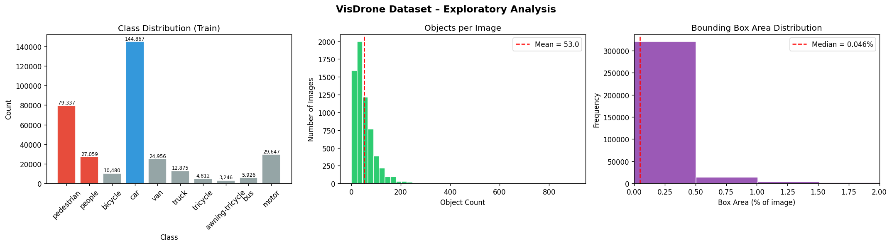

Key observations:

- **Extreme small objects** — median bounding-box area is a fraction of a percent of the full image.
- **High density** — many frames contain dozens-to-hundreds of annotated objects.
- **Heavy class imbalance** — pedestrians and cars dominate; buses and awning-tricycles are rare.

### Sample annotations

A random batch of labelled training images, illustrating the crowding and scale variation:

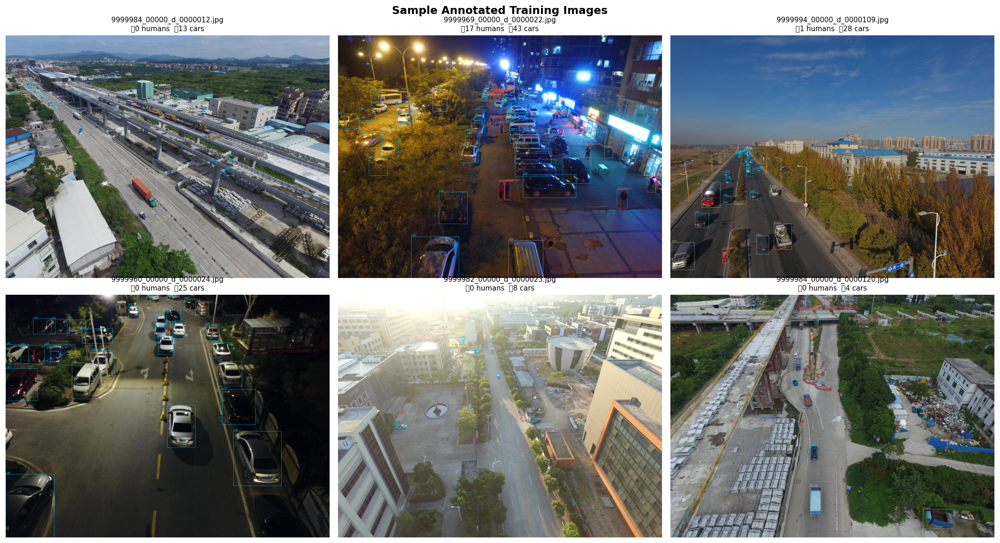

### Augmentation strategy

To address small-object scarcity and occlusion, the training pipeline uses a
mosaic-heavy augmentation schedule with copy-paste and mixup:

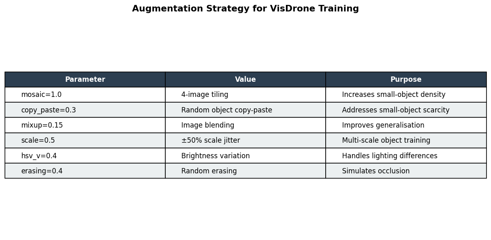

The corresponding `visdrone.yaml` is generated in-notebook and consumed by Ultralytics.

---

## 4. Model & Training (Task 02)

| Item | Value |
|------|-------|
| Architecture | YOLO11x (Ultralytics) |
| Pretrained weights | COCO |
| Optimizer | AdamW |
| Initial LR | 1e-3 |
| LR final factor | 0.01 |
| Momentum | 0.937 |
| Weight decay | 5e-4 |
| Warmup epochs | 3 |
| Image size | 640 (training) / 1280 (evaluation) |
| Batch size | 4 |
| Epochs | 25 |
| Mixed precision | AMP enabled |
| Mosaic | 1.0 (closed during last 15 epochs) |
| Copy-paste | 0.3 |
| Mixup | 0.15 |
| Scale jitter | ±50% |
| Random erasing | 0.4 |

### Training curves

Loss components (box / class / DFL) for train and validation, plus mAP, precision,
recall, and the learning-rate schedule:

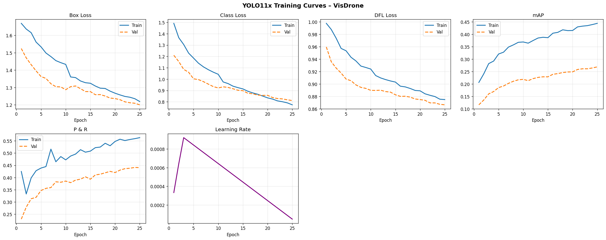

### Built-in Ultralytics results panel

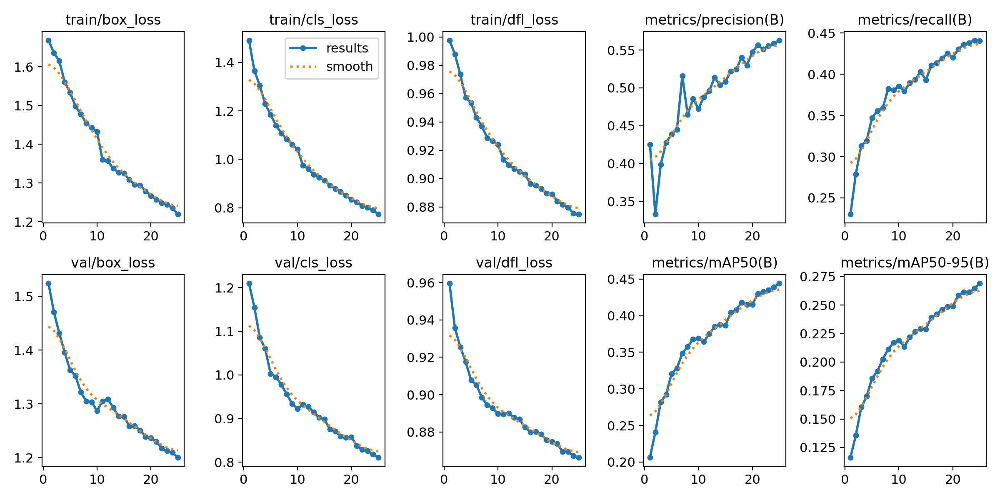

### Confusion matrix

Per-class confusion at the chosen confidence threshold:

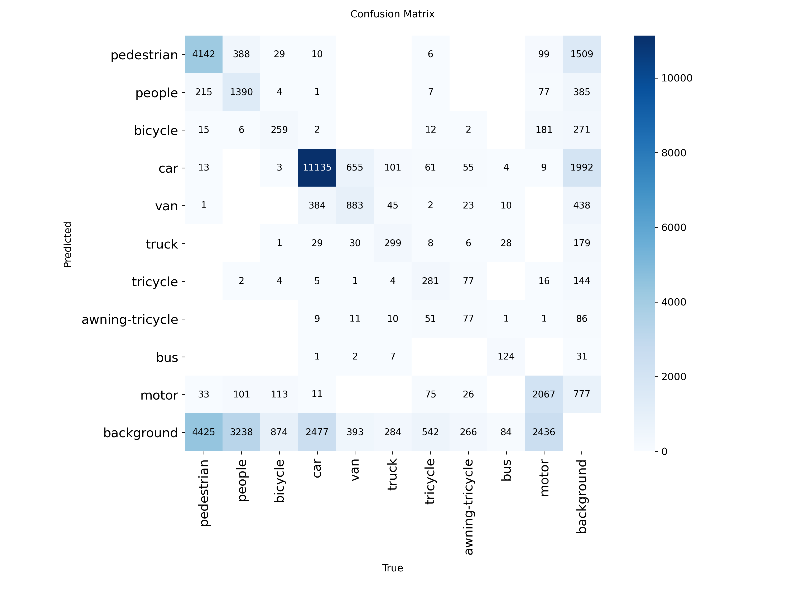

### Sample validation predictions

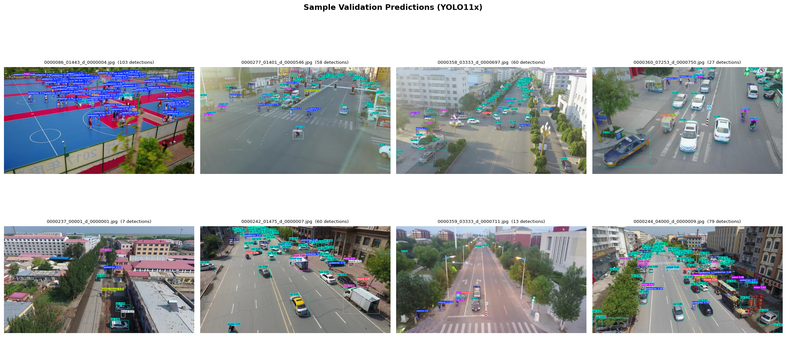

---

## 5. Detection & Counting (Task 03)

The `detect_and_count` function runs inference, filters predictions down to humans
and cars, draws colour-coded boxes, and renders a HUD with live counts.

- **Pedestrian** — red
- **People** — orange
- **Car** — cyan

Eight randomly sampled validation images with annotated counts and per-image FPS:

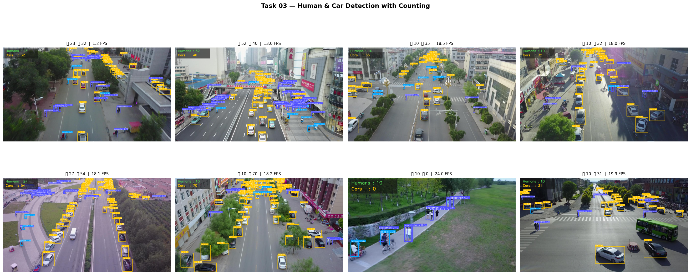

Individual annotated frames are also saved to `outputs/det_*.jpg`. Examples:

| | |
|---|---|
| 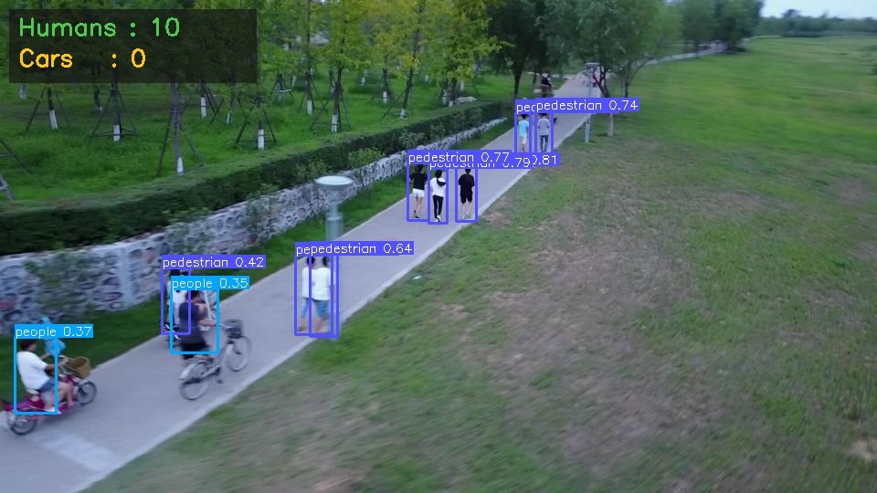 | 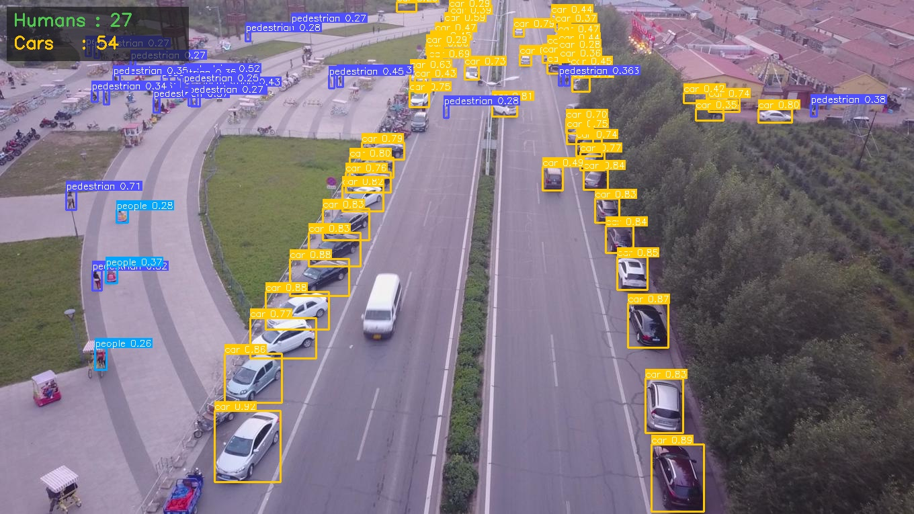 |
| 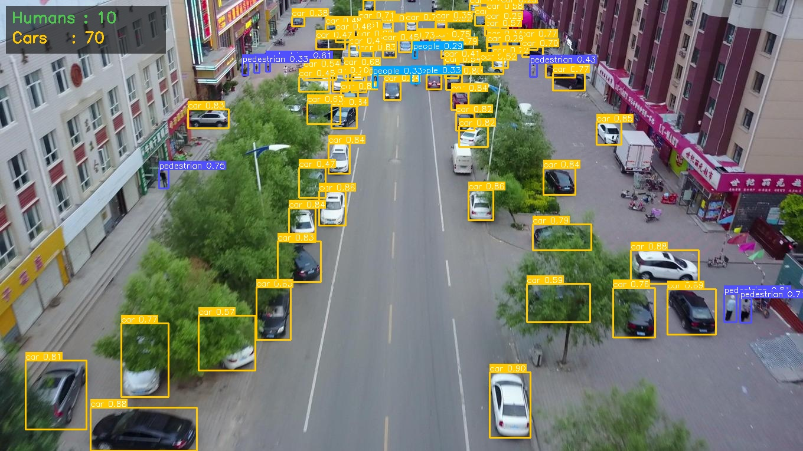 | 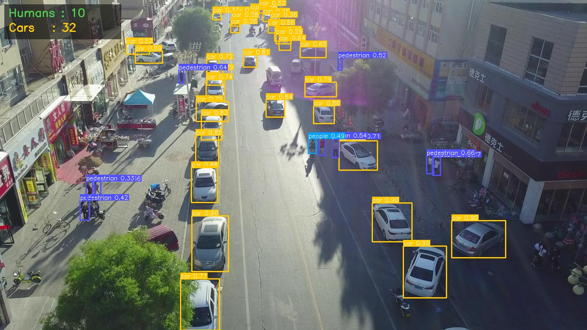 |
| 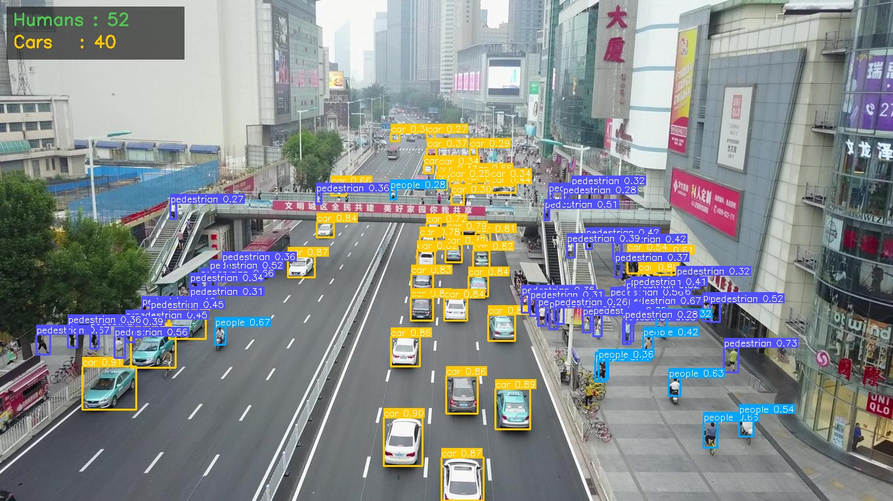 | 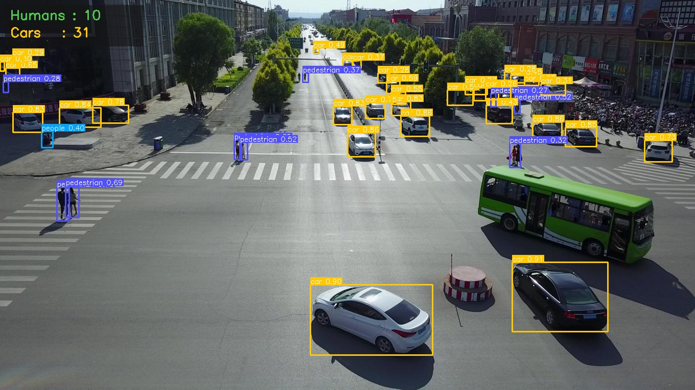 |
| 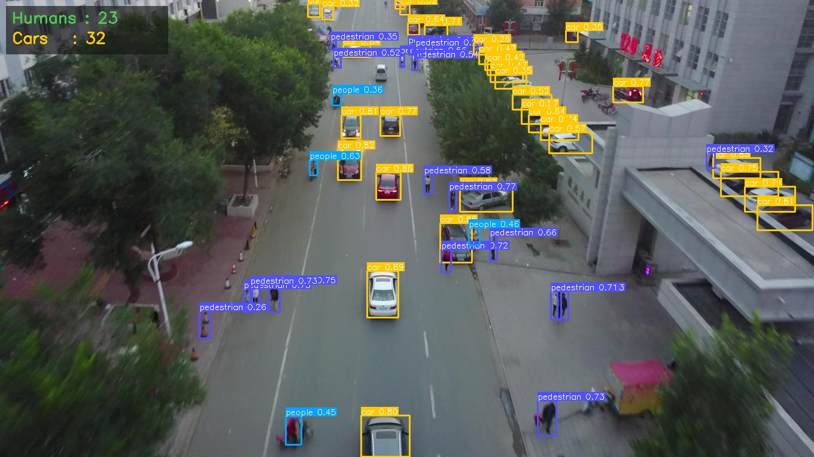 | 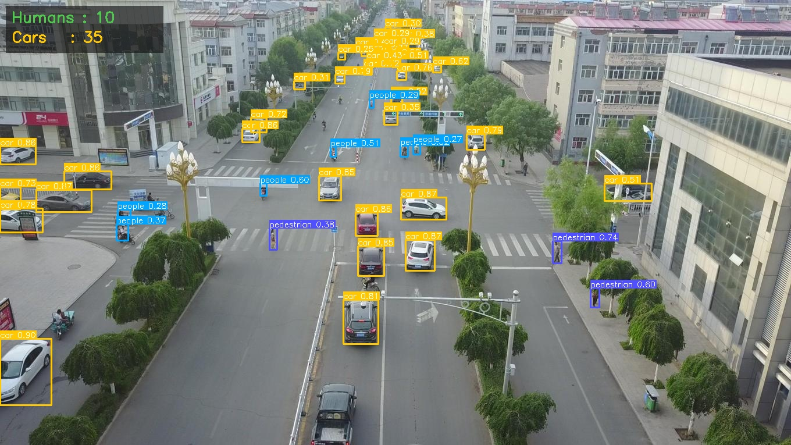 |

Each frame's HUD reports the current human and car counts in real time.

---

## 6. Multi-Object Tracking (Task 04 — Bonus)

Tracking uses **ByteTrack** (`bytetrack.yaml`) via Ultralytics' built-in
`model.track(...)` interface. The notebook strings together 120 validation
frames as a synthetic video, persists tracker state across calls, and draws:

- Per-object bounding boxes with stable `IDxx` labels
- Motion trails (last 30 positions) per tracked ID
- A HUD showing frame index and live human / car counts

The full demo video is saved to:

**[outputs/tracking_demo.mp4](outputs/tracking_demo.mp4)**

Per-frame counts of tracked humans and cars across the sequence:

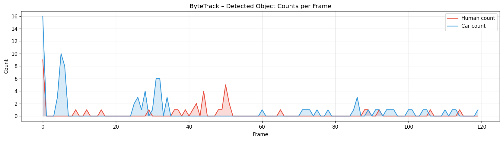

This view makes it easy to see crowding spikes and class composition over time.

---

## 7. Evaluation (Task 05)

Validation is re-run at `imgsz=1280`, `conf=0.001`, `iou=0.6` to produce a clean
precision/recall curve and per-class statistics.

### Per-class metrics

AP@50 and mAP@50-95 broken down by class. Humans (red) and cars (blue) are
highlighted; other classes are grey:

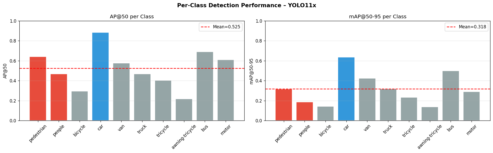

### Final dashboard

A single consolidated view: overall metrics, per-class AP@50 (horizontal),
count distribution from the tracking experiment, and three example annotated
detections:

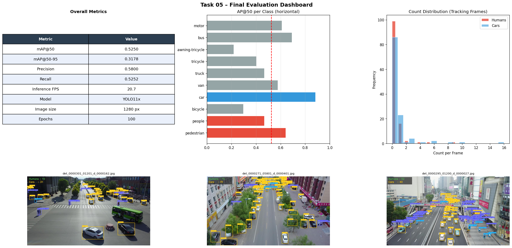

### FPS benchmark

The notebook times 50 predictions on the GPU at `imgsz=640` to report
inference FPS for the deployed model.

---

## 8. Strengths, Limitations, Challenges

**Strengths**
- YOLO11x delivers a strong speed/accuracy trade-off at this scale.
- Mosaic + copy-paste augmentation materially improves small-object recall.
- ByteTrack provides ID-consistent tracking with no extra training cost.
- Evaluating at `imgsz=1280` preserves fine detail in aerial frames.

**Limitations**
- Very small objects (under ~8 pixels) are still missed in dense scenes.
- The tracking "video" is assembled from independent stills, so the temporal
  motion model is artificial.
- Class imbalance keeps AP on rare classes (bus, awning-tricycle) low.
- GPU memory limits batch size at full resolution.

**Challenges faced**
- Extreme scale variation across drone altitudes.
- Severe crowding causes occlusion and missed detections.
- Label noise in the original VisDrone annotations.
- Long training time at high resolution on consumer-tier GPUs.

---

## 9. Repository Layout

```
droneVision/
├── ants-phase2.ipynb         # End-to-end notebook (all tasks)
├── README.md                 # This file
└── outputs/                  # Generated artifacts
    ├── eda_overview.png
    ├── sample_annotations.png
    ├── augmentation_strategy.png
    ├── training_curves.png
    ├── results.png
    ├── confusion_matrix.png
    ├── val_predictions.png
    ├── task03_detection_counting.png
    ├── det_*.jpg             # Per-image detection + counting
    ├── tracking_demo.mp4     # ByteTrack demo
    ├── tracking_counts.png
    ├── per_class_metrics.png
    └── final_dashboard.png
```

---

## 10. Reproducing the Results

### Requirements

```bash
pip install ultralytics supervision lapx
pip install matplotlib seaborn pandas numpy pillow tqdm opencv-python
```

The notebook was developed on Kaggle with a single GPU; paths under `/kaggle/`
should be adjusted if running elsewhere.

### Steps

1. Place the VisDrone dataset at the path referenced by `BASE_DIR` in Cell 2.
2. Run the notebook top-to-bottom. Each task is one cell:
   - Cell 3 — EDA
   - Cell 4 — `visdrone.yaml`
   - Cell 5 — YOLO11x training
   - Cell 6 — Curves, confusion matrix, sample val predictions
   - Cell 7 — Human / car detection + counting
   - Cell 8 — ByteTrack tracking demo
   - Cell 9 — Final evaluation dashboard
3. All visual artifacts are written to `OUTPUT_DIR` (`/kaggle/working/outputs`
   on Kaggle; copy them here as `outputs/` to mirror this README).

### Tips

- If you hit OOM on smaller GPUs, lower `imgsz` to 512 or `batch` to 2.
- Cell 6 includes a recovery block that locates the most recent training run
  if `BEST_MODEL_PATH` is lost (e.g., kernel restart).
- For real video input, point Cell 8's loop at an `mp4` file via `cv2.VideoCapture`
  instead of the synthetic frame list.

---

## 11. Acknowledgements

- **VisDrone Team** — for releasing the dataset and benchmark.
- **Ultralytics** — for the YOLO11 implementation and integrated trackers.
- **ByteTrack authors** — for the tracker baked into Ultralytics.
